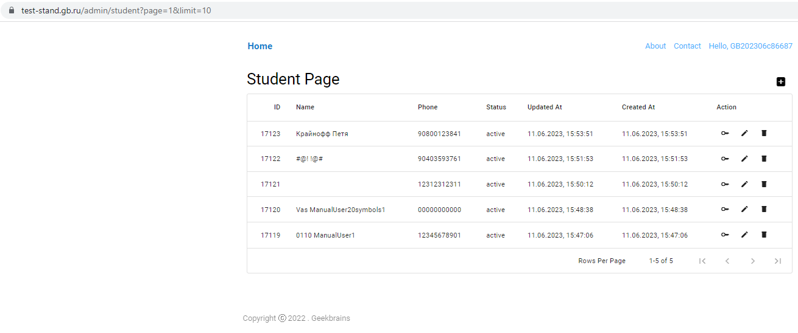

# Урок 1. Клиент-серверная архитектура

аккаунты на
GeekTest: https://docs.google.com/spreadsheets/d/1R0MQ-bjngRbb5dkc66CYgttl0u9kUexORMcm-nJZog4/edit?usp=sharing
Вам необходимо:

1) ознакомиться с описанием проекта,
2) авторизоваться в выданную преподавателем учетную запись,
3) создать 1 - 5 тестовых пользователей в личном кабинете
   Ссылка на
   документацию: https://docs.google.com/document/d/1jzq2RsU0_3ULU-1oj6zatqsGvrhMRyYZ5gWT0-CtlUs/edit?usp=sharing

## Solution

